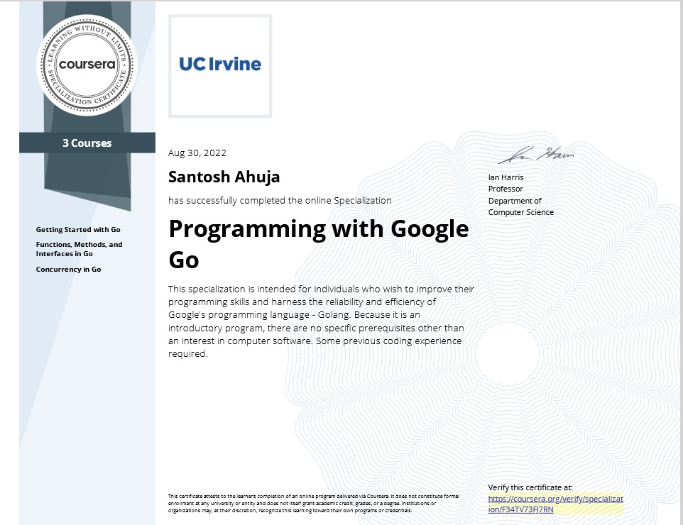

# Programming with Google Go: Specialization Coursework

<table border="0">
<tr>
<td width="60%" valign="top">

Assignment solutions and practice programs from the three-course **Programming with Google Go** specialization (University of California, Irvine — instructor Ian Harris, via Coursera).

The specialization introduces the Go programming language from Google and its distinguishing features: static typing with inference, composition over inheritance, interfaces satisfied implicitly, and CSP-style concurrency built on goroutines and channels.

The three courses progress from language fundamentals through methods and interfaces to concurrent programming.


[](LICENSE)

</td>

<td width="40%" align="center" valign="top">



</td>
</tr>
</tr>
</table>

## How to Run

Every file in this repository is a standalone `package main` program with its own `main()`. They are **not** a single buildable package — run them one at a time:

```bash
go run makejson.go
go run Read.go names.txt
go run Dining_Philosophers.go
```

`go build ./...` and `go vet ./...` will fail at the repository root, because multiple `main` functions share one directory and `Module1.go` declares `package main1`. This is a scratchpad repo, not a module.

The concurrency programs are worth running under the race detector — `race.go` in particular exists to demonstrate a race, so the detector should flag it:

```bash
go run -race race.go
```

---

## Course 1 — Getting Started with Go

Language fundamentals: the compilation model, the type system, control flow, composite types, and structs.

| File | Assignment | What it does |
|---|---|---|
| `Trunc.go` | Practice | Reads a float from stdin and prints it truncated to an integer via type conversion |
| `findian.go` | "Findian" | Reports whether a word starts with `i`, ends with `n`, and contains an `a` — case-insensitive, using `strings.Index` / `LastIndex` / `IndexAny` |
| `slice.go` | Week 3, Assignment 1 | Reads integers indefinitely into a slice that grows with input, re-sorting after every entry |
| `makejson.go` | Week 4, Assignment 1 | Prompts for a name and address, builds a `map[string]string`, and marshals it to JSON |
| `Read.go` | Week 4, Assignment 2 | Reads a file of space-separated first/last names into a slice of `Person` structs and prints them; enforces a 20-character name limit |
| `Animals.go` | Week 5 | `Animal` struct with pointer-receiver `Eat` / `Move` / `Speak` methods; accepts `<animal> <action>` commands for cow, bird, and snake |
| `Module1.go` | Scratch | Module-1 notes: constants, `int16` → `int32` conversion. Declares `package main1` and is not runnable as-is |

---

## Course 2 — Functions, Methods, and Interfaces in Go

First-class functions and closures, pointer versus value receivers, and interfaces satisfied without declaration.

| File | Assignment | What it does |
|---|---|---|
| `BubbleSort.go` | Week 1, Assignment 1 | Reads ten integers into an `[]int64` and sorts in place with bubble sort, demonstrating that slices carry a reference to their backing array |
| `Displace.go` | Week 2, Assignment 1 | `GenDisplaceFn` — takes acceleration, initial velocity, and initial position, and returns a closure computing `½at² + v₀t + s₀` |
| `AnimalIntf.go` | Week 4, Assignment 1 | `Animal` **interface** implemented by `Cow`, `Bird`, and `Snake`; supports `newanimal` and `query` commands with a map of interface values |

`Animals.go` (listed under Course 1 above) is the struct-and-methods precursor to `AnimalIntf.go`. Reading the two side by side is the clearest illustration in this repo of what the interface actually buys you — the command loop stops switching on animal type and starts dispatching through the interface.

---

## Course 3 — Concurrency in Go

Goroutines, channels, the `sync` package, and classic synchronization problems.

| File | Assignment | What it does |
|---|---|---|
| `race.go` | Week 2, Assignment 1 | Deliberate race condition: a doughnut maker produces every 1s while an eater consumes every 500ms, driving the shared counter negative and producing a different result on every run |
| `subarrays.go` | Week 3, Assignment 2 | Splits eight integers into four subarrays, sorts each in its own goroutine under a `sync.WaitGroup`, then merges the results |
| `Dining_Philosophers.go` | Week 4, Assignment 2 | Dining Philosophers with chopsticks as `sync.Mutex` and a **host** goroutine that admits a limited number of diners at a time via a channel, preventing deadlock without lock ordering |
| `chan_eg1.go` | Practice | Minimal unbuffered-channel example showing send/receive blocking between a producer goroutine and `main` |
| `threadedsort.go` | Practice | In-place quicksort with last-element pivot. Despite the filename this one is single-threaded — `subarrays.go` is the concurrent sort |

---

## Other Files

`Testbed.go` is a scratch file of exercises from the video lectures — `strings.Replace` behavior, switch semantics, Fibonacci, and struct literals. Most of it is commented out; uncomment the block you want before running.

`other_examples/` holds earlier drafts and alternate takes on the same assignments — several attempts at the philosophers problem (`philosophers.go`, `philosophers(1).go`, `philosopherss.go`), separate concurrent sorts (`sort_multipleThread.go`, `integer_sort.go`), and kinematics variants (`kinematics.go`, `formula.go`). Filenames overlap with the top-level solutions; the top-level versions are the submitted ones.

---

## Notes

Solutions follow each assignment specification as written, which sometimes means a hand-rolled algorithm where the standard library would do — bubble sort rather than `sort.Slice`, because the exercise is about slice semantics and call-by-value, not about sorting.

Header comments in the submitted files record the class, week, assignment number, and the Go version they were written against (1.16, on Windows). They still build on current Go; nothing here depends on removed APIs or on generics.

---

## License

Solution code in this repository is released under the MIT License. Course materials and assignment prompts remain the property of the University of California, Irvine and Coursera.

If you are currently enrolled in this specialization, check Coursera's Honor Code before reading solutions to assignments you have not yet submitted.
